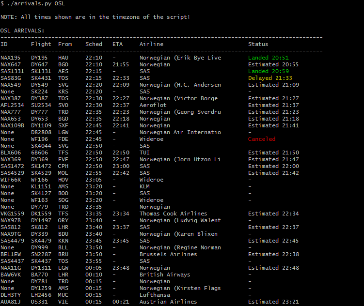
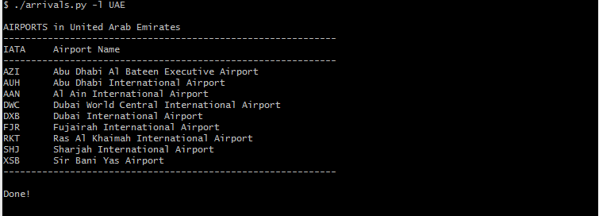
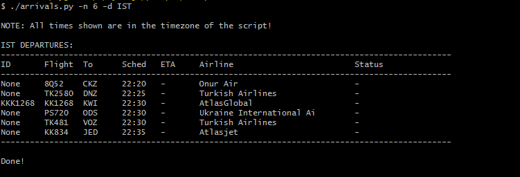
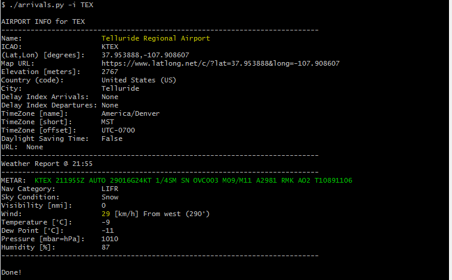

### The IATA Arrivals CLI (Command Line Interface)

[![pypi supported versions][1]][2]
[![PyPI version][3]][4]
[![Maintenance][5]][6]
[![GitHub last commit][7]][8]
[![Average time to resolve an issue][9]][10]

[1]: https://img.shields.io/pypi/pyversions/iata-arrivals-cli.svg
[2]: https://pypi.python.org/pypi/iata-arrivals-cli
[3]: https://badge.fury.io/py/iata-arrivals-cli.svg
[4]: https://badge.fury.io/py/iata-arrivals-cli
[5]: https://img.shields.io/badge/Maintained%3F-yes-green.svg
[6]: https://GitHub.com/E3V3A/iata-arrivals-cli/graphs/commit-activity
[7]: https://img.shields.io/github/last-commit/E3V3A/iata-arrivals-cli.svg
[8]: https://github.com/E3V3A/iata-arrivals-cli/commits/master "Last commits to Master branch"
[9]: http://isitmaintained.com/badge/resolution/E3V3A/iata-arrivals-cli.svg
[10]: http://isitmaintained.com//project/E3V3A/iata-arrivals-cli "Average time to resolve an issue"

[13]: https://api.codacy.com/project/badge/Grade/176ceaabe43d4113b535f2fbd0487a9e
[14]: https://www.codacy.com/app/E3V3A/iata-arrivals-cli?utm_source=github.com&amp;utm_medium=referral&amp;utm_content=E3V3A/iata-arrivals-cli&amp;utm_campaign=Badge_Grade


A simple tool to show dapartures, arrivals and various airport information given an IATA code or country name.

| STATUS: | Version | Date | Maintained? |
|:------- |:------- |:---- |:----------- |
| Working | `1.0.2` | 2022-01-21 | YES |


**Example Output:**

  
<sub>(FFS always include a screenshot in your GitHub repo!)</sub>

#### Repo Description

This is a repository of various *Python3* and (eventually) *Node.js* tools that can be 
used to obtain various flight information from airports around the globe. The tools 
here depend on both some open source libraries and some provider API's. However, most 
likely the functionality of this can easily be broken as the services are private and 
the tools often depend on various forms of web scraping and API hacking.


---

**Q:** *What does **`arrivals`** do?*

`arrivals` is a *Python3* script that display current arrivals and departures given an 
airport [IATA](https://en.wikipedia.org/wiki/IATA_airport_code) code. However, it can also show 
additional airport and weather information. These include items such as:

- The official *IATA* full/long *Name* of the airport
- The IATA and [ICAO](https://en.wikipedia.org/wiki/ICAO_airport_code) airport codes
- The *`Lat/Lon`* GPS coordinates with *map* `URL`
- The Airport *website* `URL`
- The current weather info such as:  
  *`Nav, Sky, Visibility, Temperature, Pressure, Wind Speed/Direction, Humidity`* etc.
- The Airport's current *`METAR`* info
- The ICAO code and IATA names of most officially listed airports for a given country name.
- The most recent and scheduled *non-stop* flights between 2 given airports.


**Q:** *What does it **not** do?*

- show detailed flight info
- show aircraft or carrier info
- show aiport info for airports not connected to the international  
  air traffic controller (ATC) network or internet.
- it may not show the very latest METAR data (depending on Airport availability)


---

#### Screenshots! 







### Dependencies

This package depend on the API library [pyflightdata](https://github.com/supercoderz/pyflightdata), 
which is used to collect all the relevant data from the `FlightRadar24` site. However, that library 
in turn depend on: 

- *`beautifulsoup4, jsonpath-rw, lxml, metar, requests, ply, decorator, html5lib, webencodings`*

It is also recommended to install *`lxml`* **before**, you install *pyflightdata*, 
because that dependency often require extra source compiling, which is prone to 
additional dependency errors. 


### Installation

For pip install:

```bash
pip install iata-arrivals-cli
```

For manual/development install:

0. First install all dependencies from above
1. Then install `pyflightdata`
2. Then clone this repository
3. Then install it in your bin path at your convenience

In other words you can do this:

```bash
# pip install <dependencies-from-above>
pip install pyflightdata
git clone https://github.com/E3V3A/iata-arrivals-cli.git
cd iata-arrivals-cli
#pip install iata-arrivals-cli
```


### Usage

```
$ arrivals -h

 Usage:  arrivals [options] <airport-IATA-code>

 Options:
        -d <airport-iata>    -- Show Departures instead of Arrivals (default)
        -n <n>               -- Only show next <n> number of flights
        -i <airport-iata>    -- Show information about an Airport given its IATA code [Country, Lat/Lon, TZ]
        -j <1,2>             -- Enable debug mode at level 1 or 2 to print the full JSON response
        -l <country-name>    -- List all available airport IATA codes for a country given by <country-name>
        -m <airport-iata>    -- Get last hour's METAR data for an airport given by its IATA <airport-code>
        -x <iata-1> <iata-2> -- Show direct fligths between 2 airports given by their <iata> codes
        -c                   -- Print Copyright License and maintenance URL.
        -v                   -- Print program Version
        -h, --help           -- Print this help


 --- IMPORTANT! -----------------------------------------------
   • All times shown are in the timezone of your computer!
   • Do not attempt to run these queries in rapid succession,
     as your IP might get blocked by the API providers.
 --------------------------------------------------------------
```

---

### Development
 
Feel free to send a PR in case you have some improvements.


### Related Projects

- [pyflightdata](https://github.com/supercoderz/pyflightdata)
- [flightradar24](https://github.com/mkorkmaz/flightradar24)
- [MMM-aviationwx](https://github.com/dam3313/MMM-aviationwx/) - A [MagicMirror](https://github.com/MichMich/MagicMirror) METAR module 
- [MMM-FlightsAbove](https://github.com/E3V3A/MMM-FlightsAbove) - A MagicMirror Module for displaying current flights in the sky above you!
- Do you know of - or have any others? (Post it in an new issue.)

#### Even more...

- https://github.com/jhermsmeier/node-flight-designator
- https://github.com/ram-nadella/airport-codes
- https://github.com/jpatokal/openflights
- https://github.com/derhuerst/flightradar24-client
- https://github.com/iatacodes/nodejs-sdk
- https://github.com/Otetz/iata_codes
- https://github.com/msgrasser/iata-parser
- https://github.com/leopieters/aviation-edge-api
- https://github.com/marians/py-icao-aircrft

[and so on...](https://github.com/search?p=13&q=iata&type=Repositories&utf8=%E2%9C%93)


### Related Services Used

1. http://pyflightdata.readthedocs.io/en/latest/pyflightdata.html
2. https://www.latlong.net/
3. https://aviationweather.gov/
4. `http://services.faa.gov/airport/status/<IATA_CODE>?format=application/json`
5. http://www.fly.faa.gov/flyfaa/usmap.jsp

---

### License


  
[![GitHub license][21]][22]  
A license to :sparkling_heart:!

<sub>I use `GPLv3` because sharing code modifications is more beneficial for the world.</sub>

[21]: https://img.shields.io/github/license/E3V3A/iata-arrivals-cli.svg
[22]: https://github.com/E3V3A/iata-arrivals-cli/blob/master/LICENSE.txt
